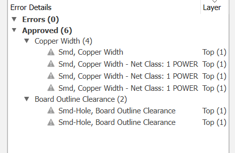

# OpenBook

## Block Diagram

## Implementation steps

1. Schematic Design

   - The schematic was created based on the provided electrical diagram.
   - Components were added using the DeskAssistant library.
   - An Electrical Rules Check (ERC) was performed to ensure there were no errors or missing connections.

2. PCB Layout

   - The schematic was transferred to the PCB editor using "Switch to PCB."
   - Components were arranged according to the layout reference.
   - The board outline was drawn to the required dimensions, including necessary cutouts.
   - Key components were positioned first for visibility, while resistors and capacitors were placed based on their proximity in the schematic.
   - Auto-routing was performed on both the top and bottom layers using a 0.15 mm trace width.
   - Power traces were manually adjusted to have a minimum width of 0.30 mm for proper current handling.
   - Ground planes were created using the GND signal, followed by via stitching to improve ground continuity.
   - Most stitching vias were placed around the antenna area for enhanced grounding and RF performance.

3. 3D Components

   - 3D models were assigned in the schematic using the [Component Search Engine] (https://componentsearchengine.com).
   - Models were accurately aligned based on their footprints for realistic placement in 3D view.

4. Case Update

   - After placing the PCB inside the enclosure, the case design was modified to accommodate connectors.
   - Adjustments were made to ensure all ports were accessible and properly aligned.

5. Custom 3D Models
   - 3D models for the enclosure and display were created based on technical drawings and datasheets.
   - These models were then placed into the final assembly to verify fit and alignment.

## Bill of Materials (BOM)

| Component                | Link                                                                                                                       | Datasheet                                                                                                                                                                                                                                    |
| ------------------------ | -------------------------------------------------------------------------------------------------------------------------- | -------------------------------------------------------------------------------------------------------------------------------------------------------------------------------------------------------------------------------------------- |
| BME680                   | [Model](https://www.snapeda.com/parts/BME680/Bosch/view-part/?welcome=home)                                                | [Datasheet](//efaidnbmnnnibpcajpcglclefindmkaj/https://www.bosch-sensortec.com/media/boschsensortec/downloads/datasheets/bst-bme680-ds001.pdf)                                                                                               |
| BUTTON                   | [Model](https://industry.panasonic.com/global/en/products/control/switch/light-touch/number/evqpuj02k)                     | [Datasheet](https://www.lcsc.com/datasheet/lcsc_datasheet_2201121800_PANASONIC-EVQPUJ02K_C2936858.pdf)                                                                                                                                       |
| CAPACITOR                | [Model](<https://componentsearchengine.com/part-view/R0402%201%25%20100%20K%20(RC0402FR-07100KL)/YAGEO>)                   | [Datasheet](//efaidnbmnnnibpcajpcglclefindmkaj/https://www.resistor.com/assets/pdf/0402tstd.pdf)                                                                                                                                             |
| R0402                    | [Model](<https://componentsearchengine.com/part-view/R0402%201%25%20100%20K%20(RC0402FR-07100KL)/YAGEO>)                   | [Datasheet](//efaidnbmnnnibpcajpcglclefindmkaj/https://www.resistor.com/assets/pdf/0402tstd.pdf)                                                                                                                                             |
| CPH3225A                 | [Model](https://www.snapeda.com/parts/CPH3225A/Seiko+Instruments/view-part/?ref=eda)                                       | [Datasheet](https://octopart.com/datasheet/cph3225a-seiko-25340571)                                                                                                                                                                          |
| EVQPUJ02K                | [Model](https://industry.panasonic.com/global/en/products/control/switch/light-touch/number/evqpuj02k)                     | [Datasheet](https://www.lcsc.com/datasheet/lcsc_datasheet_2201121800_PANASONIC-EVQPUJ02K_C2936858.pdf)                                                                                                                                       |
| KP-1608SURCK             | [Model](https://www.snapeda.com/parts/KP-1608SURCK/Kingbright/view-part/?ref=search&t=LED%200603)                          | [Datasheet](//efaidnbmnnnibpcajpcglclefindmkaj/https://media.elv.com/file/107153_led_surck1608_data.pdf)                                                                                                                                     |
| USBLC6-2SC6Y             | [Model](https://www.snapeda.com/parts/USBLC6-2SC6Y/STMicroelectronics/view-part/?ref=eda)                                  | [Datasheet](https://www.digikey.com/en/htmldatasheets/production/1375342/0/0/1/usblc6-2sc6y)                                                                                                                                                 |
| SD0805S020S1R0           | [Model](https://ro.mouser.com/ProductDetail/KYOCERA-AVX/SD0805S020S1R0?qs=jCA%252BPfw4LHbpkAoSnwrdjw%3D%3D)                | [Datasheet](https://www.alldatasheet.com/view.jsp?Searchword=SD0805S&sField=2)                                                                                                                                                               |
| PGB1010603MR             | [Model](https://www.snapeda.com/parts/PGB1010603MR/Littelfuse/view-part/?ref=eda)                                          | [Datasheet](https://www.alldatasheet.com/view.jsp?Searchword=Pgb1010603mr&gad_source=1&gbraid=0AAAAADcdDU8aYfZtfJfdZ9I5j6RwZ_cbA&gclid=Cj0KCQjwqcO_BhDaARIsACz62vOPBOBe0eOh5gDUFkkKl4JBcbmoFZYtJ8BOnbaWqr_BuUCcVWvbutAaAmGkEALw_wcB)         |
| BD5229G-TR               | [Model](https://componentsearchengine.com/part-view/BD5229G-TR/ROHM%20Semiconductor)                                       | [Datasheet](https://www.lcsc.com/datasheet/lcsc_datasheet_2201131330_ROHM-Semicon-BD5229G-TR_C962636.pdf)                                                                                                                                    |
| XC6220A331MR-G           | [Model](https://componentsearchengine.com/part-view/XC6220A331MR-G/Torex)                                                  | [Datasheet](https://www.alldatasheet.com/view.jsp?Searchword=Xc6220&gad_source=1&gbraid=0AAAAADcdDU8aYfZtfJfdZ9I5j6RwZ_cbA&gclid=Cj0KCQjwqcO_BhDaARIsACz62vPS06NB6tLgniZzfaVpKNu1m811BNk6AEPfg4DbP6f5S8QWA_pW_UQaAv-0EALw_wcB)               |
| USB4110-GF-A             | [Model](<https://componentsearchengine.com/part-view/USB4110-GF-A/GCT%20(GLOBAL%20CONNECTOR%20TECHNOLOGY)>)                | [Datasheet](//efaidnbmnnnibpcajpcglclefindmkaj/https://gct.co/files/drawings/usb4110.pdf)                                                                                                                                                    |
| Adafruit LEDCHIP-LED0603 | [Model](https://eu.mouser.com/ProductDetail/Adafruit/4208?qs=PzGy0jfpSMtbScLbr0L5dw%3D%3D)                                 | [Datasheet](https://www.arrow.com/en/manufacturers/adafruit-industries/datasheets)                                                                                                                                                           |
| Bobina                   | [Model](https://store.comet.srl.ro/Catalogue/Product/43497/)                                                               | [Datasheet](https://www.scribd.com/document/814581278/Datasheet-Bobina)                                                                                                                                                                      |
| PFMF                     | [Model](https://www.mouser.co.uk/ProductDetail/EPCOS-TDK/B72520T0350K062?qs=dEfas%2FXlABIszF52uu7vrg%3D%3D)                | [Datasheet](https://ro.mouser.com/c/ds/circuit-protection/thermistors/resettable-fuses-pptc/?m=Schurter&series=PFMF)                                                                                                                         |
| DMG2305UX-7              | [Model](https://componentsearchengine.com/part-view/DMG2305UX-7/Diodes%20Incorporated)                                     | [Datasheet](//efaidnbmnnnibpcajpcglclefindmkaj/https://www.mouser.com/datasheet/2/115/DMG2305UX-266242.pdf?srsltid=AfmBOop22k34YTJJra1xubiU6LPiN4M4JlcWbRoSNdxSGFak8uWgXPpK)                                                                 |
| Si1308EDL-T1-GE3         | [Model](https://componentsearchengine.com/part-view/SI1308EDL-T1-GE3/Vishay)                                               | [Datasheet](https://www.alldatasheet.com/view.jsp?Searchword=Si1308edl&gad_source=1&gbraid=0AAAAADcdDU-px713ONYSnQ2O-gcwqYcFq&gclid=Cj0KCQjwqcO_BhDaARIsACz62vN_Nz3MJOc6J_03gnVBm7aSqC8v9wyP0VD-iRKP-gFrYgdhLi99I14aAlVJEALw_wcB)            |
| MCP73831T-5ACI/OT        | [Model](https://www.mouser.co.uk/ProductDetail/Microchip-Technology/MCP73831T-5ACI-OT?qs=hH%252BOa0VZEiAcgAcEkuamXg%3D%3D) | [Datasheet](//efaidnbmnnnibpcajpcglclefindmkaj/https://ww1.microchip.com/downloads/en/DeviceDoc/MCP73831-Family-Data-Sheet-DS20001984H.pdf)                                                                                                  |
| SMD Solder               | [Model](https://grabcad.com/library/solder-jumpers-1)                                                                      | [Datasheet]()                                                                                                                                                                                                                                |
| W25Q512JVEIQ             | [Model](https://www.snapeda.com/parts/ESP32-C6-WROOM-1-N8/Espressif+Systems/view-part/?ref=eda)                            | [Datasheet](//efaidnbmnnnibpcajpcglclefindmkaj/https://www.mouser.com/datasheet/2/949/W25Q512JV_SPI_RevB_06252019_KMS-2487502.pdf?srsltid=AfmBOoquExqDVgxEELF9CzuOGxHos0CD1nQDROHD6Eebdm2foNzqozqU)                                          |
| ESP32-C6-WROOM-1-N8      | [Model](https://www.snapeda.com/parts/ESP32-C6-WROOM-1-N8/Espressif+Systems/view-part/?ref=eda)                            | [Datasheet](//efaidnbmnnnibpcajpcglclefindmkaj/https://www.mouser.com/catalog/specsheets/Espressif_ESP32_C6_WROOM_1%20_Datasheet_V0.1_PRELIMINARY_en.pdf?srsltid=AfmBOooHQKNitqODRaaPjoZInfWKTacDER1t5uRK6sKqT13TrzvVo_B7)                   |
| DS3231SN#                | [Model](https://www.snapeda.com/parts/DS3231SN%23/Analog+Devices/view-part/?ref=eda)                                       | [Datasheet](https://www.alldatasheet.com/view.jsp?Searchword=Ds3231sn%20datasheet&gad_source=1&gbraid=0AAAAADcdDU-Gy9URfMxGmqiPg7ci5L3wR&gclid=Cj0KCQjwqcO_BhDaARIsACz62vMkK3ETSnW2w7mo0Fa-wgWJGn89AxWCyIND6k5X8MmoPl6hv6VWwT8aAiS-EALw_wcB) |
| MAX17048G+T10            | [Model](https://www.snapeda.com/parts/MAX17048G+T10/Analog+Devices/view-part/?ref=eda)                                     | [Datasheet](https://www.alldatasheet.com/view.jsp?Searchword=Max17048&gad_source=1&gbraid=0AAAAADcdDU8aYfZtfJfdZ9I5j6RwZ_cbA&gclid=Cj0KCQjwqcO_BhDaARIsACz62vNa9xrVfzjCjADRwXD0RBbo4Nret3ywwteDGLJKZui8ZL8KdVlTE7caAvQxEALw_wcB)             |

## Hardware Overview

The central unit of the system is the ESP32-C6-WROOM-1-N8, a 32-bit RISC-V microcontroller running at 160 MHz. It manages all processing tasks, communication protocols, and system control. It includes integrated support for Wi-Fi 6 (2.4 GHz) and Bluetooth 5.0, enabling reliable wireless connectivity for IoT applications.

## Power Supply & Battery Management

- Battery: Rechargeable 3.7V 1800mAh Li-Po battery, chosen for its compact size and high energy density.

- Charging Module: Based on the MCP73831T, which provides efficient and safe USB charging (5V input through USB-C).

- Voltage Regulation: A low-dropout (LDO) regulator provides a consistent 3.3V output required by the system components.

- Protections: Integrated safeguards against overcharging and deep discharge ensure long battery life and safe operation.

## Display module

- The device features a 7.5-inch E-Ink display, ideal for low-power, high-contrast applications.

- With a resolution of 800x480 pixels, it delivers sharp, readable content.

- It operates over the SPI bus, offering fast updates while minimizing power usage.

## Storage Solutions

- MicroSD Module: Offers expandable storage using FAT32, communicating via SPI.

- External NOR Flash (64MB): Provides additional non-volatile storage, also interfaced through SPI.

## Connectivity & User Input

- USB-C Port: Serves as both the power input and a communication channel, supported by ESD protection and a Schottky diode for reverse current prevention.

- Tactile Buttons: Provide manual input options for user interaction.

- Interfaces in Use:

  - GPIOs: Used for button input and other control signals

  - SPI: Shared by the SD card, flash memory, and display

  - I2C: Used by environmental sensor and RTC

  - UART: Utilized for debugging and serial monitoring

  - Wi-Fi & Bluetooth: Integrated in the ESP32-C6 for remote communication

## Errors

While editing the PCB in Fusion 360, I encountered the following errors:

The errors occurred due to the size of the holes in the PCB, so I approved them.
